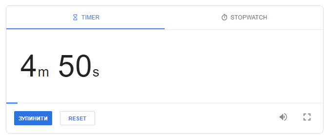
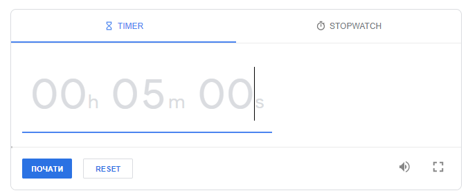

Create countdown timer

### Functionality
- Start countdown time should be 5 min
- Button "Stop" should pause countdown
- Button "Start" should resume countdown
- Button "Reset" should set countdown the bening

### Editing the time
When clicking on timer, it should change to input 
for setting new countdonwn time

a) When clicking Enter, new time should be applied and countdown start

b) When clicking outside of the input, new time should be applied but without starting the countdown

[Countdown example](https://www.google.com/search?q=countdown+timer&sxsrf=AJOqlzX4sVjBGHk4Kd1ZYx2usZoVg6SyGw%3A1677950924257&ei=zH8DZOWND6uW9u8P_PuAmAQ&oq=countdown&gs_lcp=Cgxnd3Mtd2l6LXNlcnAQAxgAMgcIIxCwAxAnMgoIABBHENYEELADMgoIABBHENYEELADMgoIABBHENYEELADMgoIABBHENYEELADMgoIABBHENYEELADMgoIABBHENYEELADMgoIABBHENYEELADMgcIABCwAxBDMgoILhDUAhCwAxBDMgcIABCwAxBDMgoILhDUAhCwAxBDMgwILhDIAxCwAxBDGAEyDAguEMgDELADEEMYATIMCC4QyAMQsAMQQxgBMgwILhDIAxCwAxBDGAEyDAguEMgDELADEEMYATIMCC4QyAMQsAMQQxgBSgQIQRgAUABYAGCKEWgBcAF4AIABAIgBAJIBAJgBAMgBEsABAdoBBggBEAEYCA&sclient=gws-wiz-serp)

